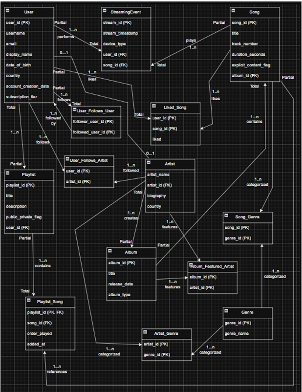

# Music Streaming Database

A relational database for a simplified music streaming service called StreamBase,
built in MySQL. Covers the full development lifecycle from requirements analysis
and ER diagram through to physical implementation with views, stored procedures,
and triggers.

---

## ER Diagram



The ER diagram was the starting point for the entire project. Each entity,
relationship, and cardinality was mapped out before any SQL was written, which
made the implementation stage significantly more straightforward.

---

## Schema Overview

**13 tables** across two categories:

**Core entities**
| Table | Description |
|-------|-------------|
| users | Platform accounts with username, email, and subscription tier |
| artist | Artist profiles, optionally linked to a user account |
| album | Albums and EPs tied to a primary artist |
| song | Individual tracks belonging to an album |
| playlist | User-created song collections |
| genre | Genre categories |
| streaming_event | Every play event with timestamp and device type |

**Junction tables (many-to-many relationships)**
| Table | Relationship |
|-------|-------------|
| playlist_song | Songs within a playlist, ordered by position |
| liked_song | Songs a user has liked |
| user_follows_user | User-to-user follow relationships |
| user_follows_artist | User-to-artist follow relationships |
| song_genre | Genres assigned to a song |
| artist_genre | Genres assigned to an artist |
| album_featured_artist | Featured artists on an album |

---

## Design Decisions

**Normalization:** The schema follows Third Normal Form (3NF). Each table stores
only attributes directly relevant to its primary key, avoiding redundant data.

**User and Artist** are modeled as a one-to-one optional relationship — not every
user is an artist and not every artist is a user. The `artist` table holds a nullable
`user_id` foreign key to reflect this.

**Junction tables** handle all many-to-many relationships. Each depends on its
parent entities to exist, making them weak entities. For example, `playlist_song`
cannot exist without both a `playlist` and a `song`. The same applies to
`liked_song`, `user_follows_user`, `user_follows_artist`, `song_genre`,
`artist_genre`, and `album_featured_artist`.

**Song ordering within playlists** is handled by an `order_played` column on
`playlist_song`, ensuring each track has a defined position that can be updated
or reordered without breaking normalization.

**Album_Featured_Artist** was created to allow multiple artists per album, avoiding
the limitation of a single `artist_id` on the album table.

**Genre** is its own entity rather than a column on song or artist, because both
songs and artists can belong to multiple genres. Making it a column would require
repeating or concatenating data, which breaks normalization.

**Indexes** are applied to `streaming_event` on `user_id` and `song_id` — the
two columns hit hardest by analytical queries.

**What I would do differently:** Adding a `Song_Featured_Artist` junction table
would make it easier to assign featured artists at the song level rather than only
at the album level, making the design more flexible and closer to how a real
streaming service works.

---

## Queries

14 analytical queries covering:

- All songs in a specific album ordered by track number
- All playlists owned by a specific user
- All users following a given artist
- Streaming history for a user in the past 30 days
- All explicit songs
- Top 10 most-streamed songs of all time
- Total streams per artist
- Unique songs listened to per user
- Songs that appear in more than one playlist
- Users with no streaming history
- Most-listened-to artist per user (correlated subquery)
- Mutual followers between users (self-join)
- Albums where every song has been streamed at least once
- Average song duration by genre

---

## Views, Procedures & Triggers

**Views**
| View | Description |
|------|-------------|
| `song_stats` | Stream count and unique listeners per song |
| `user_library` | Each user's liked songs with artist and album |
| `artist_popularity` | Total streams, followers, and songs per artist |

**Stored Procedures**
| Procedure | Description |
|-----------|-------------|
| `record_stream` | Logs a new streaming event with the current timestamp |
| `add_song_to_playlist` | Appends a song to a playlist at the next position |
| `get_user_top_songs` | Returns a user's top N songs by stream count |

**Triggers**
| Trigger | Description |
|---------|-------------|
| `prevent_duplicate_liked_song` | Blocks a user from liking the same song twice |
| `enforce_explicit_age_gate` | Blocks users under 18 from streaming explicit content |

---

## Sample Data

- 10 users across Free, Premium, and Family subscription tiers
- 5 artists — Post Malone, Bad Bunny, The Weeknd, Mac Miller, The Neighbourhood
- 8 albums, 40 songs across 5 genres (Hip-Hop, Reggaeton, R&B, Alternative, Pop)
- 100 streaming events across 10 days with varied device types
- 24 liked songs, 20 user-follow-user relationships, 13 user-follow-artist relationships

---

## How to Run

**1. Clone the repository**
```bash
git clone https://github.com/maurice46/music-streaming-db
cd music-streaming-db
```

**2. Open MySQL and create a database**
```sql
CREATE DATABASE music_streaming;
USE music_streaming;
```

**3. Run the files in order**
```sql
SOURCE 01_create_tables.sql;
SOURCE 02_insert_data.sql;
SOURCE 03_queries.sql;
SOURCE 04_procedure_triggers.sql;
```
